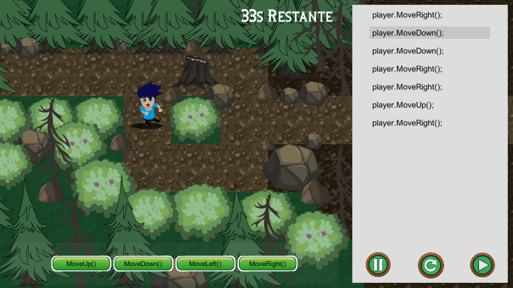
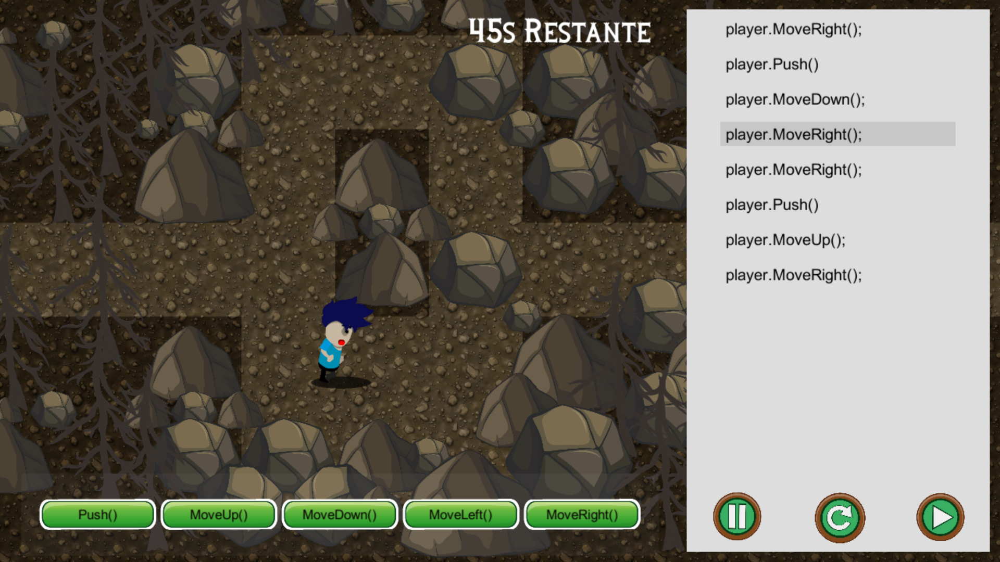

# Dungeons-and-Code
 
Desenvolvido pela Fábrica de Software do UNIPE.

Dungeons and Code é um jogo de estratégia que ensina lógica de programação
onde o usuário controla um programador preso dentro de um game e que para sair ele
deve finaliza-lo passando dos levels e derrotando o chefe final.

Um jogo educativo direcionado a estudantes recém ingressados em um curso de
TI para aprender lógica e programação.

O jogo será ambientado em uma floresta abandonada, onde o jogador controlará
o Devi dentro de uma floresta cheia de desafios, onde ele deve montar as instruções de
movimento e ações do personagem utilizando os blocos de código para chegar ao final
de cada level.

## Jogabilidade

Usuário vai arrastar os comandos da caixa de código para o painel a direita
montando o código ao terminar o jogador apertará o botão de start e o personagem
fará o que está indicado no código. Os comandos são: “MoveLeft();”, “MoveRight();”,
“MoveUp();”, “MoveDown();”, “Push();” e o “For();”.

- MoveLeft(); - Movimenta o personagem à esquerda.

- MoveRight(); - Movimenta o personagem à direita.

- MoveUp(); - Movimenta o personagem para cima.

- MoveDown(); - Movimenta o personagem para baixo.

- Push(); - Empurra um objeto.

- For(); - Permite repetir uma sequência montada pelo jogador.

